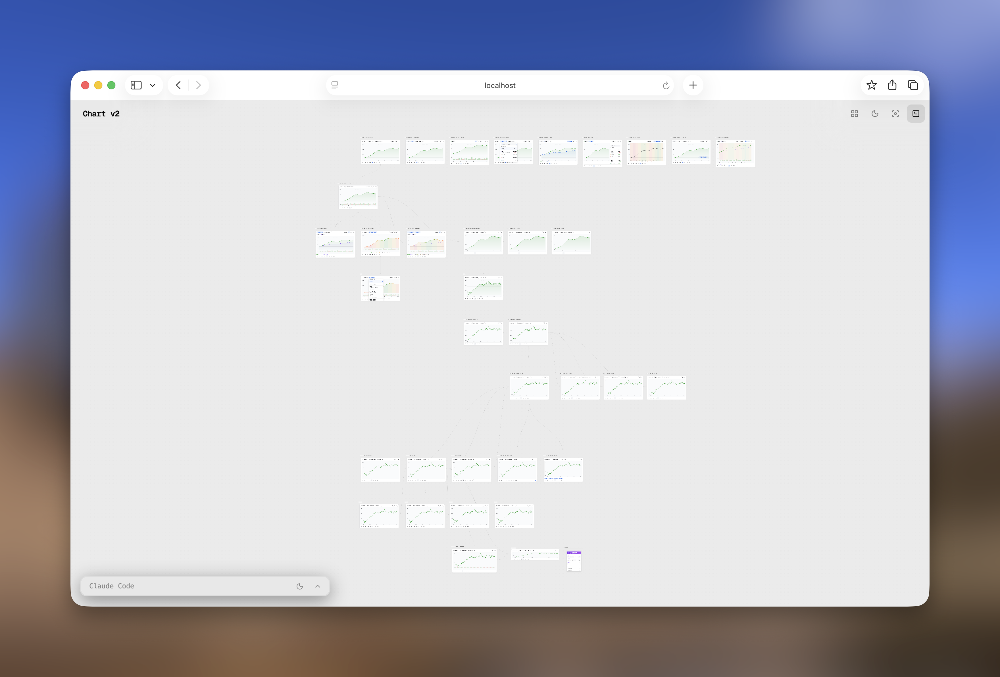
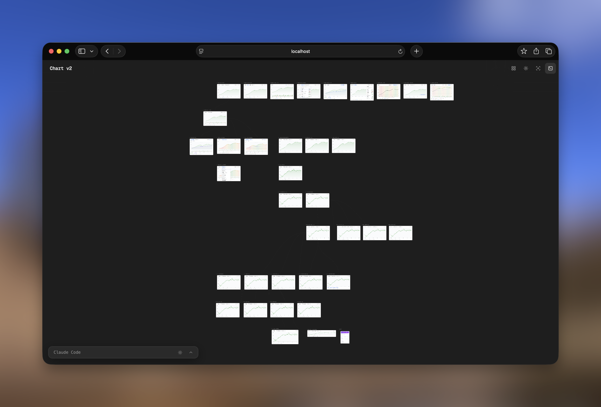
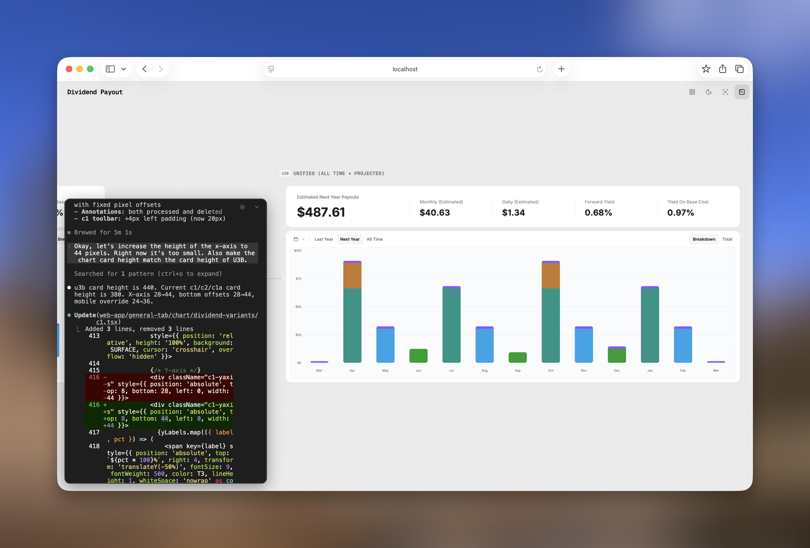
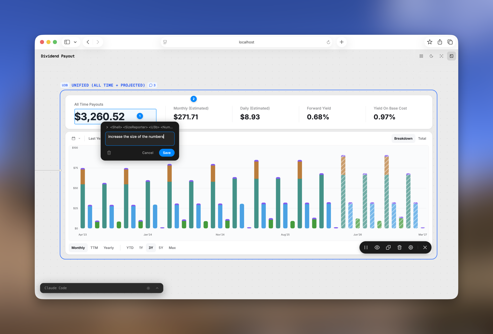
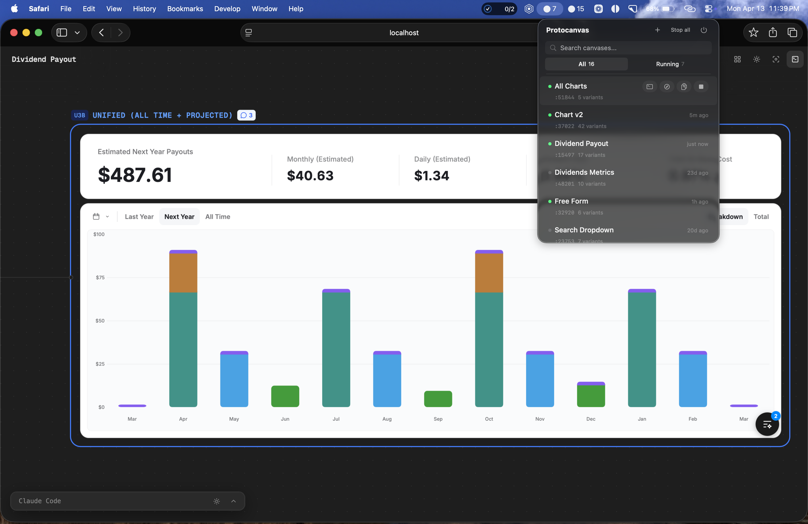

# Protocanvas

**An experimental canvas for designing React UI directly in code.**

Protocanvas is a code-native design workspace for exploring UI directions side by side instead of iterating through a single linear chat thread. The power of tools like Figma comes from the canvas itself: you can branch ideas freely, compare versions spatially, and understand how a design evolved. That canvas-based workflow is mostly missing when designing directly with AI and code.

Protocanvas brings that missing piece into the coding-first workflow. Each prototype lives on the canvas as a real React component or HTML variant, not a mockup. You can compare live iterations, annotate specific elements, and ask Claude to process the feedback without losing the context of previous versions.

Status: Experimental beta. Works today for a real Claude-driven workflow. Codex support is planned next.

## The Workflow Stack

Protocanvas is more than just the canvas UI. The current workflow is built from four pieces working together:

- **Protocanvas canvas**: the spatial workspace where variants live side by side
- **[Agentation](https://www.agentation.com/)**: the element-level annotation layer inside each variant
- **`protocanvas` skill**: the Claude-side workflow and instruction layer that knows how to generate, branch, inspect, and iterate on variants
- **Manager app**: the lightweight macOS control surface for starting, stopping, and managing canvas sessions

That full stack is what makes the current workflow work end to end.

## Demo

- Loom walkthrough: https://www.loom.com/share/be91a696a44a4dfea66ec0a08f0e5655

### Canvas Overview

Light mode



Dark mode



### In-Canvas Workflow

Embedded terminal



Element-level annotations with [Agentation](https://www.agentation.com/)



### Session Manager

Experimental macOS manager



## Why It Exists

When you design in code with an AI coding assistant, the workflow is often too linear:

- you ask for a change
- the previous version gets overwritten
- you lose the ability to compare the old and new directions properly
- it becomes harder to judge whether the change was actually an improvement

Protocanvas is built around the missing canvas workflow:

- branch multiple ideas instead of overwriting one
- compare variants side by side
- keep iteration lineage visible
- leave feedback on exact elements
- iterate on working prototypes rather than flat mockups

## Core Workflow

1. Generate or create multiple variants of a component as real TSX or HTML files.
2. View those variants as live iframes on an infinite canvas.
3. Compare different directions spatially instead of linearly.
4. Focus a variant and annotate exact elements with feedback.
5. Let Claude read the annotations and apply the requested changes.
6. Keep the design lineage visible until one version clearly wins.

## What Makes It Useful

- **Real prototypes, not static mockups**: each canvas card is a live component, not a vector approximation
- **Spatial comparison**: multiple versions stay visible at once so you can judge changes in context
- **Element-level annotations**: leave feedback on specific UI elements instead of writing ambiguous instructions
- **AI inside a structured workflow**: Claude operates against variants, annotations, and lineage rather than a single chat-only loop
- **Production-adjacent output**: the winning variant is already code, which reduces the jump from design to implementation

## Features

- **Interactive canvas**: pan, zoom, drag, snap-align, minimap, tidy-up auto-layout
- **Focus mode**: click a card to zoom to 100% and interact with the live variant
- **Element-level annotations**: powered by [Agentation](https://www.agentation.com/)
- **Hot reload**: edit a variant file and the canvas updates instantly
- **Stable ports**: the same component gets the same port across restarts
- **Persistent annotations**: annotations survive server restarts
- **Lineage versioning**: variant IDs encode ancestry such as `v3a2`
- **Undo**: `Ctrl/Cmd+Z` restores deleted nodes
- **Resizable cards**: drag edges or enter exact dimensions
- **TSX + HTML support**: render React components or plain HTML variants
- **Keyboard shortcuts**: `V` select, `H` pan, `F` focus mode, `M` minimap, `R` reset zoom, `` ` `` terminal
- **Embedded terminal**: Claude Code or another shell runs inside the canvas UI
- **Manager app**: an experimental macOS menu bar utility for controlling local canvas sessions

## Current Status

Protocanvas is not being presented as a polished general-purpose production tool yet. It is an experimental beta built around a real working workflow that is already useful for interactive UI iteration.

Current positioning:

- local-first
- Claude-first
- macOS-oriented in parts of the tooling
- best suited for early adopters comfortable working close to the implementation

## Current Limitations

- Protocanvas is currently optimized for Claude-driven workflows.
- Codex support is the next planned integration.
- Parts of the tooling are still tailored to the current local development environment.
- The setup works, but it is not yet packaged as a polished one-command install.
- The menu bar manager is still experimental and macOS-specific.

## How It Works

1. **Variants are created as code**: each direction is a standalone TSX or HTML file.
2. **Variants appear on the canvas**: every variant renders inside its own iframe card.
3. **You compare and explore**: move, resize, group, and inspect multiple directions at once.
4. **You annotate exact elements**: focus a variant and leave comments on specific UI pieces.
5. **Claude reads the feedback**: annotations are stored by the canvas server and can be processed by Claude.
6. **The best version wins**: keep iterating until one branch clearly becomes the final design.

## Prerequisites

- [Node.js](https://nodejs.org/) 18+
- [Claude Code](https://docs.anthropic.com/en/docs/claude-code) for the full variant-generation and iteration workflow
- Xcode Command Line Tools (`xcode-select --install`) for `node-pty` native addon compilation

## Setup

### 1. Clone and install

```bash
git clone https://github.com/adithyag99/protocanvas.git
cd protocanvas

npm install
cd variant-renderer && npm install && cd ..
```

### 2. Build the canvas app

```bash
npm run build
```

### 3. Start the canvas server

```bash
node .protocanvas-server.mjs <project-dir> <component-name> <variants-dir>

# Example
node .protocanvas-server.mjs ./my-project "Dashboard Card" dashboard-card-variants
```

The server starts on a stable port derived from the component name:

```text
DESIGN_CANVAS_PORT=30047
Canvas app: http://localhost:30047
```

If TSX variants are detected, the Vite renderer starts automatically on a separate stable port.

### 4. Open the canvas

Navigate to `http://localhost:{port}` in your browser.

## Annotations

[Agentation](https://www.agentation.com/) provides the element-level annotation toolbar inside each variant iframe.

- Agentation is required for the full feedback workflow.
- It is installed as part of the `variant-renderer` dependencies during setup.
- no external annotation server is required
- annotations are forwarded to the canvas server via `POST /api/annotations`
- the canvas server stores them as the source of truth
- Claude can read pending feedback via `GET /api/annotations`

Agentation is a core part of the current feedback loop, not just an optional add-on. It is what makes element-level review practical inside live variants.

## Claude Workflow

Protocanvas currently works best when used with Claude Code and the `protocanvas` skill.

The `protocanvas` skill is the starting point of the workflow. It gives Claude the operating context for how to work with the canvas, variants, annotations, and lineage. In practice, it is what turns the canvas from a viewer into an actual iteration system.

The skill or workflow layer understands:

- how to generate new variants
- how to read canvas annotations
- how to branch versus edit in place
- how to resolve feedback after changes are applied

That skill-driven workflow is part of the current real-world usage model, but the repository is still being cleaned up for broader portability.

## Manager App

Protocanvas also includes an experimental macOS menu bar manager for controlling local canvas sessions.

It is useful for:

- starting and stopping canvases
- listing active sessions
- jumping back into existing canvases quickly
- managing a local workflow where multiple canvases may be active at once

This manager is part of the current working setup, but it is still macOS-specific and experimental.

## Architecture

For a deeper technical walkthrough of the app, server, renderer, and protocol, see [ARCHITECTURE.md](ARCHITECTURE.md).

```text
┌─────────────────────────────────────────────┐
│  Canvas App (React + React Flow + Zustand) │
│  - Variant cards with iframes              │
│  - Snap alignment, focus mode, undo        │
│  - State sync and interaction layer        │
└──────────────────┬──────────────────────────┘
                   │ HTTP + SSE
┌──────────────────▼──────────────────────────┐
│  Canvas Server (Node.js)                   │
│  - Serves built canvas app                 │
│  - Persists state and annotations          │
│  - Watches files and broadcasts reloads    │
│  - Spawns the TSX variant renderer         │
└──────────────────┬──────────────────────────┘
                   │ Child process
┌──────────────────▼──────────────────────────┐
│  Variant Renderer (Vite dev server)        │
│  - Renders TSX variants as live React      │
│  - Hosts Agentation inside variant frames  │
│  - Reports size and supports HMR           │
└─────────────────────────────────────────────┘
```

## Project Structure

```text
src/                               # Canvas app
├── App.tsx                        # Main React Flow canvas
├── components/
│   ├── VariantNode.tsx            # Variant card with iframe
│   ├── IterationEdge.tsx          # Edge rendering and lineage cues
│   ├── Toolbar.tsx                # Floating controls
│   ├── ContextMenu.tsx            # Right-click actions
│   └── TerminalPanel.tsx          # Embedded terminal UI
├── store/
│   ├── canvasStore.ts             # Canvas state
│   └── terminalStore.ts           # Terminal state
└── types/
    └── canvas.ts                  # Shared TypeScript types

server/                            # Canvas server utilities
├── deep-merge-state.mjs           # State merge logic
└── terminal-manager.mjs           # PTY and WebSocket bridge

variant-renderer/                  # TSX variant renderer
├── src/
│   ├── main.tsx                   # Dynamic variant loader
│   └── Shell.tsx                  # Frame shell + annotation bridge
└── vite.config.ts

bin/                               # CLI tools
├── protocanvas.mjs                # Canvas session management
└── registry.mjs                   # Registry and stable port helpers

manager/                           # Experimental macOS menu bar manager

tests/
├── deep-merge-state.test.ts
└── snap-position.test.ts
```

## API

The canvas server exposes:

| Endpoint | Method | Description |
|----------|--------|-------------|
| `/api/config` | GET | Server configuration and active ports |
| `/api/state` | GET | Current canvas state |
| `/api/state` | POST | Partial state update using deep merge |
| `/api/annotations` | GET | Pending annotations |
| `/api/annotations` | POST | Add an annotation |
| `/api/annotations/:id` | DELETE | Remove a specific annotation |
| `/api/annotations?variantId=` | DELETE | Remove annotations for a variant |
| `/__reload` | GET | SSE stream for hot reload |
| `/variants/{file}` | GET | Serve HTML variants with injected scripts |

### State Update Semantics

```json
{ "nodes": { "v1": { "position": { "x": 100, "y": 200 } } } }
{ "edges": [{ "from": "v1", "to": "v2", "label": "branch" }] }
{ "removeNodes": ["v3", "v4"] }
{ "viewport": { "x": 0, "y": 0, "zoom": 1 } }
```

## CLI

Protocanvas includes a CLI for managing canvas sessions:

```bash
protocanvas ls
protocanvas open "Chart v2"
protocanvas open 1
protocanvas stop "Chart v2"
protocanvas stop-all
protocanvas scan ~/projects
protocanvas resume "Chart v2"
protocanvas url "Chart v2"
```

Canvases can be referenced by name or by the index shown in `protocanvas ls`.

## Development

```bash
npm run dev
npm run build
npm run test
npm run lint
```

## License

MIT
